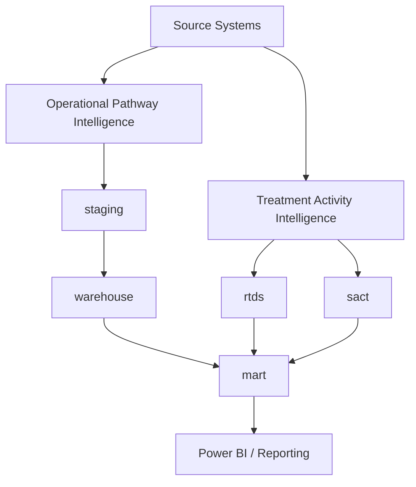

# Oncology IDR

## Purpose

The Oncology Information Data Repository (Oncology IDR) provides a central reporting and analytics platform for Portsmouth Oncology Centre.

The repository supports two distinct but complementary functions:

1. Operational Pathway Intelligence (OPS)
2. Treatment Activity Intelligence (ACT)

These datasets have different purposes, refresh frequencies, and reporting use-cases and should not be considered interchangeable.

---

## Architectural Principles

### Operational Pathway Intelligence (OPS)

Purpose:

Predictive and operational management of patients currently progressing through oncology pathways.

Questions supported:

- Which patients are waiting for treatment?
- Where are delays occurring?
- Which pathways are at risk of breaching targets?
- What future treatment demand is expected?
- What impact will capacity changes have?

Characteristics:

- Daily refresh
- Near real-time
- Prospective
- Actionable
- Supports intervention

Primary schemas:

- staging
- warehouse

Primary source systems:

- Oncology Intake Database
- ARIA
- Capacity and operational exports

---

### Treatment Activity Intelligence (ACT)

Purpose:

Analysis of treatment activity that has already occurred.

Questions supported:

- How many patients received treatment?
- Which disease groups were treated?
- What treatment intent was delivered?
- What activity was delivered by tumour site?
- What was historic service utilisation?

Characteristics:

- Monthly refresh
- Historical
- Retrospective
- Reporting and audit focused

Primary schemas:

- rtds_raw
- rtds
- sact_raw
- sact

Primary source systems:

- RTDS
- SACT

---

## High Level Architecture

---

## Data Sources

### Operational Pathway Intelligence

- Oncology Intake Database
- ARIA Referrals
- ARIA Bookings
- ARIA CT
- ARIA Treatment
- Machine Capacity Data

### Treatment Activity Intelligence

- RTDS Attendance Extract
- RTDS Prescription Extract
- SACT Administration Dataset

---

## Schemas

### Control Layer

- control

Supports ETL auditing, monitoring and load history.

### Operational Intelligence Layer

- staging
- warehouse

Supports referral management, pathway monitoring, demand prediction and operational reporting.

### Treatment Activity Layer

- rtds_raw
- rtds
- sact_raw
- sact

Supports historic treatment activity reporting and analysis.

### Shared Reporting Layer

- reference
- mart

Provides reference mappings and user-facing reporting views.

---

## Refresh Schedules

### Operational Pathway Intelligence

Frequency:

Daily

Pipeline:

run_operational_pipeline.py

Outputs:

- Oncology pathways
- Radiotherapy pathways
- Machine capacity
- Demand forecasting

### Treatment Activity Intelligence

Frequency:

Monthly

Pipeline:

run_activity_pipeline.py

Outputs:

- RTDS activity
- SACT activity
- Patient starts
- Geography reporting
- Service activity analysis

---

## Reporting Guidance

### Use Operational Intelligence when:

- Managing waiting lists
- Monitoring targets
- Predicting future demand
- Assessing service pressures
- Evaluating capacity changes

### Use Treatment Activity Intelligence when:

- Reporting completed treatments
- Producing annual activity reports
- Benchmarking services
- Analysing tumour-site activity
- Reviewing historic trends

---

## Key Design Principle

Operational Intelligence answers:

"What is happening and what is likely to happen?"

Treatment Activity Intelligence answers:

"What actually happened?"

The two data domains should be analysed together only when the business question explicitly requires linkage between pathway performance and delivered treatment activity.